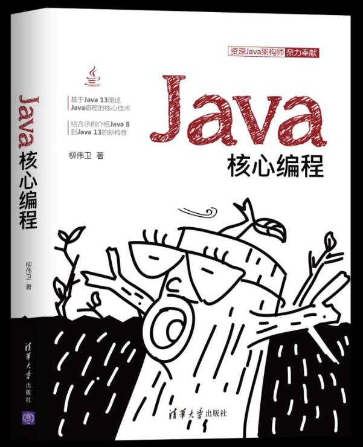

# Modern Java: From Java 8 to Java 18. 
# 现代Java案例大全
# 《Java核心编程》源码

## 内容简介

现代Java案例大全，包含从 Java 8 到 Java 18 所有新特性及其案例。学习 Java 的同志们，燥起来！

技术版本如下：

* JDK 18
* Eclipse IDE for Java Developers 2020-03 (4.15.0)
* JUnit 5.5.1
* ...

## 源码

所有示例源码，移步至<https://github.com/waylau/modern-java-demos/>  `samples` 目录下。

工程代码可以直接导入Eclipse IDE。

## 文章

* [Java版本号处理-split 点号 split(".")](https://waylau.com/java-split-dot/)
* [在 Eclipse 中 Debug Maven 项目“source not found”问题解决](https://waylau.com/maven-debug-in-eclipse-source-not-found)
* [Java 注释规范详解](https://waylau.com/java-comments-conventions/)
* [Java switch 语句使用 String 参数](https://waylau.com/java-switch-use-string/)
* [Java 编程要点之 I/O 流详解](https://waylau.com/essential-java-io-streams/)
* [Java 编程要点之并发（Concurrency）详解](https://waylau.com/essential-java-concurrency/)
* [Java I/O 模型的演进](https://waylau.com/java-io-model-evolution/)
* [在 Eclipse 里使用 PlantUML](https://waylau.com/use-plantuml-in-eclipse/)
* [使用 Eclipse Checkstyle Plugin](https://waylau.com/use-eclipse-checkstyle-plugin/)
* [使用 PMD Eclipse插件](https://waylau.com/use-pmd-for-eclipse/)
* [使用 GFM Eclipse 插件时，不在项目里面生成 HTML 文件](https://waylau.com/not-generate-html-file-with-gfm/)
* [Java 多个异常共享同一个异常处理器](https://waylau.com/java-shared-exception-handler/)
* [Java 13 新特性及实战案例](https://waylau.com/java-13-new-features-and-samples/)
* [JDK 14发布](https://waylau.com/jdk-14-released/)
* [Eclipse IDE支持Java 14](https://waylau.com/eclipse-ide-support-java14/)
* [Eclipse IDE 2020-06 R(4.16.0)发布，正式支持Java 14](https://waylau.com/eclipse-ide-2020-06-r/)
* [Eclipse中安装反编译工具Fernflower（Enhanced Class Decompiler）](https://waylau.com/eclipse-install-fernflower/)
* [Java陷阱——慎用入参做返回值](https://waylau.com/trap-in-java-use-param-for-return/)
* [Java三元表达式中的陷阱](https://waylau.com/trap-in-java-ternary-expressions/)
* [Java开发者常用软件](https://waylau.com/java-devloper-software/)
* [JDK 15发布](https://waylau.com/jdk-15-released/)
* [JDK 16发布](https://waylau.com/jdk-16-released/)
* [JDK 17发布](https://waylau.com/jdk-17-released/)
* [JDK 18已经发布！9大特性之JEP 400：默认为UTF-8](https://developer.huawei.com/consumer/cn/forum/topic/0201846479510890118?fid=23)
* [JDK 18已经发布！9大特性之JEP 408：简单Web服务器](https://developer.huawei.com/consumer/cn/forum/topic/0201847903978570159?fid=23)
* [JDK 18已经发布！9大特性之JEP 413：Java API文档中的代码段](https://developer.huawei.com/consumer/cn/forum/topic/0201847905486710160?fid=23)
* [JDK 18已经发布！9大特性之JEP 416：使用方法句柄重新实现核心反射](https://developer.huawei.com/consumer/cn/forum/topic/0204854062494110062?fid=23)
* [JDK 18已经发布！9大特性之JEP 417：Vector API（第三次孵化器）](https://developer.huawei.com/consumer/cn/forum/topic/0203854859800470079?fid=23)
* [Java下一代高并发技术——虚拟线程（Virtual Threads）](https://waylau.com/jep-425-virtual-threads-preview)
* [从Java 8升级到Java 11的注意事项](https://waylau.com/update-from-java-8-to-java-11/)
* [云原生编译器——Java Cloud Compiler](https://waylau.com/about-java-cloud-compiler/)
* [JVM即时编译器JIT小探](https://developer.huawei.com/consumer/cn/blog/topic/03852250988250097)
* [JDK 19的7 个新特性](https://waylau.com/seven-new-features-of-jdk-19/)
* [使用GraalVM原生映像彻底革新Java](https://waylau.com/reinventing-java-with-graalvm-native-images/)

## 配套书籍《Java核心编程》

与该源码配套的书籍《Java核心编程》已经出版，内容详见全书[目录](SUMMARY.md)。

本书如有勘误，会在<https://github.com/waylau/https://github.com/waylau/modern-java-demos/issues>上进行发布。由于笔者能力有限，时间仓促，难免错漏，欢迎读者批评指正。

您也可以上[豆瓣](https://book.douban.com/subject/35071286/)给老卫打Call。

## 如何获取本书

实体店及各大网店有售。据我所知有如下网站供应：

* [京东](https://search.jd.com/Search?keyword=%E6%9F%B3%E4%BC%9F%E5%8D%AB%20Java%E6%A0%B8%E5%BF%83%E7%BC%96%E7%A8%8B&enc=utf-8&wq=%E6%9F%B3%E4%BC%9F%E5%8D%AB%20Java%E6%A0%B8%E5%BF%83%E7%BC%96%E7%A8%8B&pvid=3f8660921bef4700931a735f536eebfb)
* [1号店](https://search.yhd.com/c0-0/k%25E6%259F%25B3%25E4%25BC%259F%25E5%258D%25AB%2520Java%25E6%25A0%25B8%25E5%25BF%2583%25E7%25BC%2596%25E7%25A8%258B/)
* [淘宝](https://s.taobao.com/search?q=%E6%9F%B3%E4%BC%9F%E5%8D%AB+Java%E6%A0%B8%E5%BF%83%E7%BC%96%E7%A8%8B&imgfile=&js=1&stats_click=search_radio_all%3A1&initiative_id=staobaoz_20200509&ie=utf8)
* [当当](http://search.dangdang.com/?key=%C1%F8%CE%B0%CE%C0%20Java%BA%CB%D0%C4%B1%E0%B3%CC&act=input)
* [亚马逊](https://www.amazon.cn/s?k=%E6%9F%B3%E4%BC%9F%E5%8D%AB+Java%E6%A0%B8%E5%BF%83%E7%BC%96%E7%A8%8B&__mk_zh_CN=%E4%BA%9A%E9%A9%AC%E9%80%8A%E7%BD%91%E7%AB%99&ref=nb_sb_noss)

想低于市价得到本书？来[二手书集市](https://github.com/waylau/second-hand-books)试试看。

也可以直接关注我博客（<https://waylau.com/>）或者我的开源书（<https://waylau.com/books/>）了解更多免费咨询。

 
## 联系作者

您也可以直接联系我：

* 博客：https://waylau.com
* 邮箱：[waylau521(at)gmail.com](mailto:waylau521@gmail.com)
* 微博：http://weibo.com/waylau521
* 开源：https://github.com/waylau

## 其他书籍

若您对本书不感冒，笔者还写了其他方面的超过一打的书籍（可见<https://waylau.com/books/>），多是开源电子书。

本人也维护了一个[books-collection](https://github.com/waylau/books-collection)项目，里面提供了优质的专门给程序员的开源、免费图书集合。

## 开源捐赠

捐赠所得所有款项将用于开源事业！见[捐赠](https://waylau.com/donate)列表。